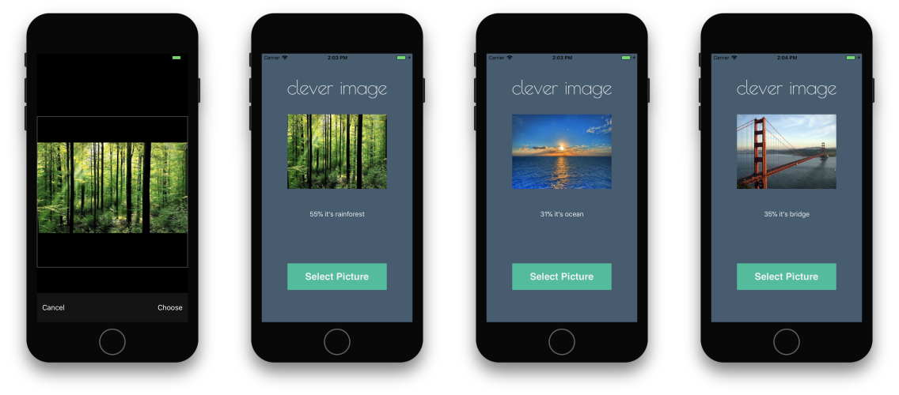

# clever-image
Basic practice about image recognition with CoreML application using Places205-GoogLeNet.

[Image Recognition with CoreML - Read on Gitbook](https://mehmetkoca.gitbooks.io/coreml/)

[CoreML ile Görüntü Tanımlama - YapayZeka.AI](https://yapayzeka.ai/coreml-ile-goruntu-tanimlama/)

[Youtube - Short usage video](https://www.youtube.com/watch?v=ZyifKDjdH1A)
